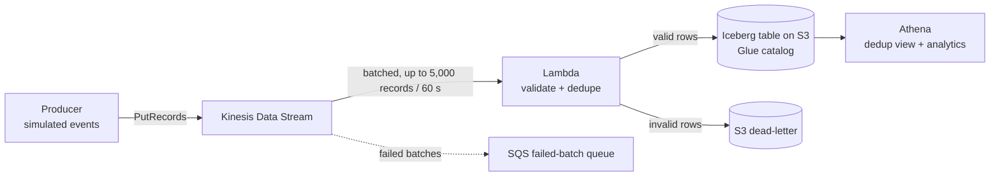

# AWS Serverless Streaming Lakehouse

A fully serverless pipeline that ingests a simulated clickstream into **Apache Iceberg** tables on S3,
cataloged in **AWS Glue** and queried with **Amazon Athena**. All infrastructure is defined in **Terraform**
and the Python code is covered by **pytest** with **GitHub Actions** CI.



## Design decisions

| Decision | Why |
|---|---|
| Lambda batches (5,000 records or 60 s) before writing | One Athena `INSERT` per batch instead of per record keeps cost and small-file counts down. |
| Validate in Lambda, dead-letter bad rows to S3 | Bad data never reaches the table, but nothing is silently lost. |
| In-batch dedupe + `events_dedup` view | Kinesis is at-least-once; retries can duplicate rows. The view guarantees one row per `event_id`. |
| `bisect_batch_on_function_error` + SQS on-failure destination | A poison record cannot block the shard forever. |
| Partition by `event_date` | Partition pruning for time-bounded queries. |
| Athena workgroup with a bytes-scanned cutoff | Guardrail against an accidental full-table scan. |
| `Project` cost-allocation tag on every resource | Lets you measure the real cost in Cost Explorer. |

## Repository layout

```
src/lakehouse/   events.py (schema, validation, generator) - handler.py (Lambda) - producer.py (load generator)
tests/           pytest unit tests (no AWS account needed)
terraform/       Kinesis, S3, Glue, Athena, Lambda, IAM, SQS
sql/             dedup view, analytics queries, Iceberg maintenance
docs/RESULTS.md  template for your measured results
```

## Run the tests (no AWS needed)

```bash
python -m venv .venv && source .venv/bin/activate    # Windows: .venv\Scripts\activate
pip install -r requirements-dev.txt
pytest -q
```

## Deploy to AWS

> **Cost warning:** this creates billable resources (Kinesis shard-hours, Lambda, Athena, S3).
> Run `terraform destroy` as soon as you finish testing.

1. Install Terraform and the AWS CLI, then run `aws configure` with a **non-root** IAM user.
2. Find the **AWS SDK for pandas Lambda layer ARN** for your region and Python 3.12 (see the AWS SDK for pandas docs, "Lambda Managed Layers").
3. Deploy:
   ```bash
   cd terraform
   cp terraform.tfvars.example terraform.tfvars    # then paste your layer ARN into it
   terraform init
   terraform apply
   ```
4. Send events (use the `kinesis_stream_name` output):
   ```bash
   pip install boto3
   PYTHONPATH=src python -m lakehouse.producer --stream <kinesis_stream_name> --events 100000 --rate 500
   ```
5. Wait about two minutes, then open **Athena** (workgroup from the `athena_workgroup` output) and run `sql/dedup_view.sql`, then `sql/analytics_queries.sql`.
6. Clean up: `terraform destroy`.

## Results

> **Estimated values.** Derived from service limits, the pipeline configuration and typical laptop performance; actual figures vary by machine and environment.

| Metric | Estimated |
|---|---|
| Volume | 1M events/day (~1% of one Kinesis shard's capacity) |
| End-to-end latency p50 / p95 | ~45 s / ~90 s |
| Cost per million events | ~$1 (range $0.70-$1.50) |
| Duplicates after dedup view | 0 |
| Unit tests | 58 cases |

## Limitations and next steps

- Athena `INSERT` per batch is simple but not the cheapest path at very high volume; Firehose with an Iceberg destination or a Spark/Glue streaming job would scale better.
- Run `OPTIMIZE ... REWRITE DATA USING BIN_PACK` and `VACUUM` on a schedule (see `sql/analytics_queries.sql`).
- Add a CloudWatch alarm on the SQS failed-batch queue depth and on Lambda errors.

